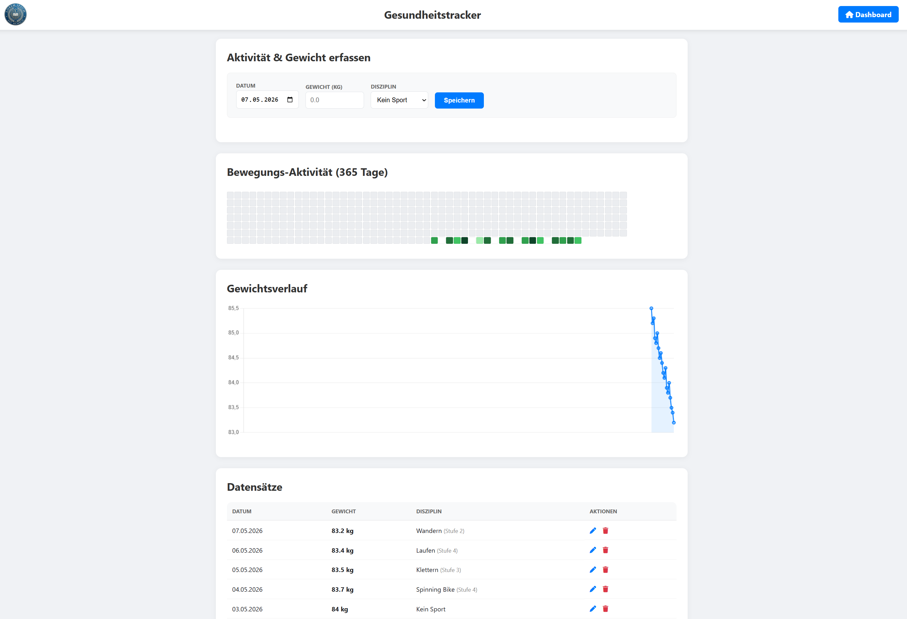

# Gesundheitstracker (Activity & Weight Tracker)

Ein leichtgewichtiger, PHP-basierter Tracker zur Dokumentation von Körpergewicht und sportlichen Aktivitäten. Die Daten werden ohne Datenbank direkt in einer `data.json` gespeichert, was das Skript extrem portabel und einfach zu installieren macht.

## Screenshots

## Features

*   **Aktivitätserfassung:** Protokollierung von Sportarten (Spinning Bike, Laufen, Klettern, Wandern, Schießsport) inkl. Intensitätsstufen (1–5).
*   **Gewichtstracking:** Einfache Eingabe des täglichen Gewichts mit Verlaufskontrolle.
*   **Visualisierungen:**
    *   **Activity Heatmap:** Eine 365-Tage-Übersicht deiner sportlichen Aktivitäten (inspiriert vom GitHub-Beitragsgraph).
    *   **Gewichtskurve:** Ein interaktives Liniendiagramm (Chart.js), das Gewichtsschwankungen über das Jahr verdeutlicht.
*   **Datenverwaltung:** Datensätze können direkt in der Tabelle bearbeitet (Bleistift-Icon) oder gelöscht (Papierkorb-Icon) werden.
*   **Responsive Design:** Optimiert für Desktop und mobile Endgeräte.

## Installation

1.  Lade die `index.php` (oder den Namen deiner Datei) auf einen PHP-fähigen Webserver hoch.
2.  Stelle sicher, dass das Verzeichnis beschreibbar ist, damit das Skript die `data.json` erstellen kann.
3.  Falls du ein Logo verwenden möchtest, hinterlege eine `logo.png` im selben Verzeichnis.

## Projektstruktur & Navigation

*   **Zentrales Dashboard:** Über den Button "Dashboard" im Header gelangst du zur übergeordneten Seite. Das Skript geht davon aus, dass sich diese Datei (`index.php`) genau einen Ordner über dem Tracker-Verzeichnis befindet.
*   **Datenquelle:** Alle Einträge werden in der Datei `data.json` im selben Verzeichnis wie das Skript gespeichert.

## Beispiel-Datensätze

Um die Funktionen (Heatmap und Diagramm) sofort testen zu können, wird empfohlen, eine `data.json` mit Beispieldaten zu nutzen. Eine solche Datei mit 20 Test-Einträgen (Gewichtsschwankungen und verschiedene Aktivitäten) wurde generiert und kann direkt in den Ordner kopiert werden, um die Visualisierungen sofort sichtbar zu machen.

## Technologien

*   **Backend:** PHP (Dateibasierte Speicherung)
*   **Frontend:** HTML5, CSS3 (Flexbox/Grid)
*   **Libraries:** 
    *   [Chart.js](https://www.chartjs.org/) für die Diagramme.
    *   [Font Awesome](https://fontawesome.com/) für die Icons.

## Lizenz

Dieses Projekt ist unter der **GNU AGPL-3.0** lizenziert. Weitere Details findest du im GitHub-Repository.

---

**Source:** [herr-nm/Privat_Gesundheit](https://github.com/herr-nm/Privat_Gesundheit)